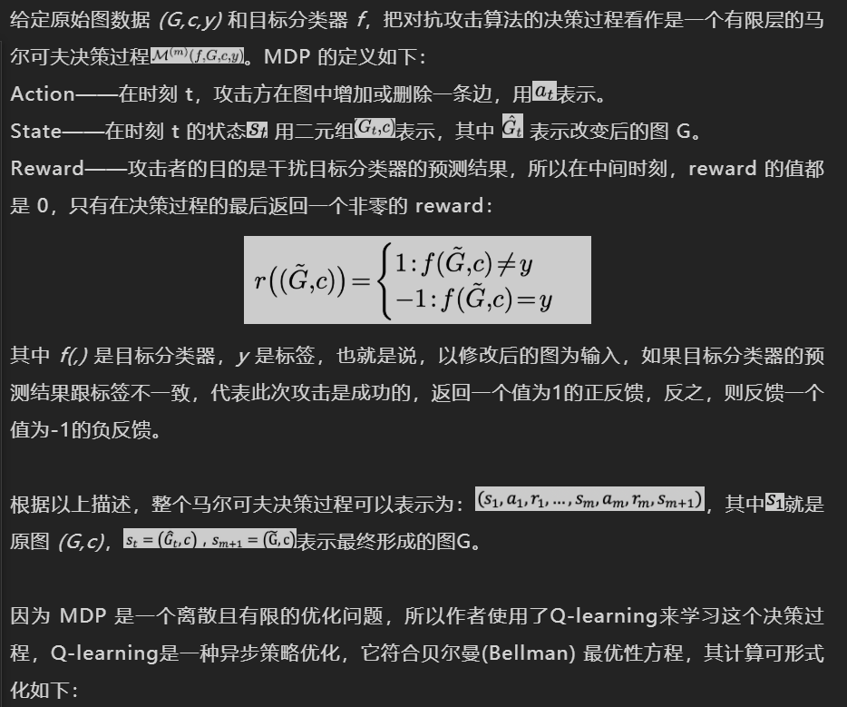
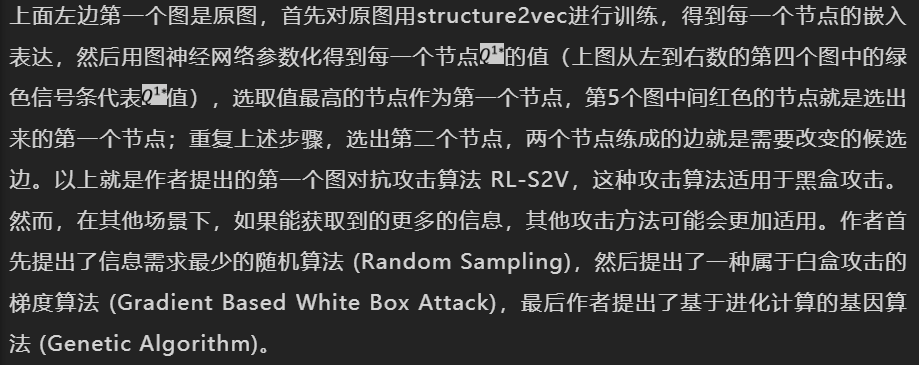
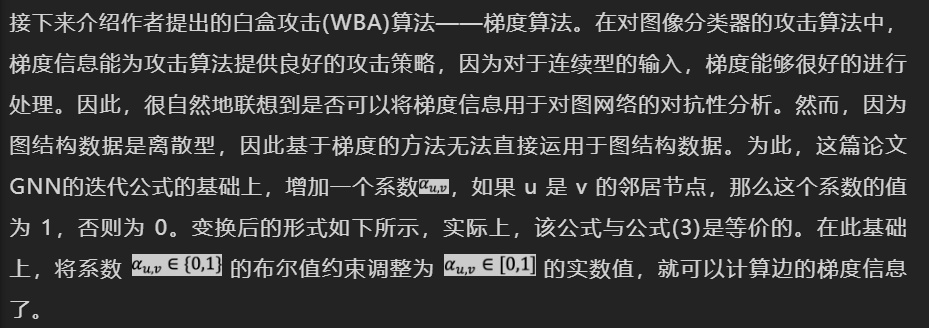
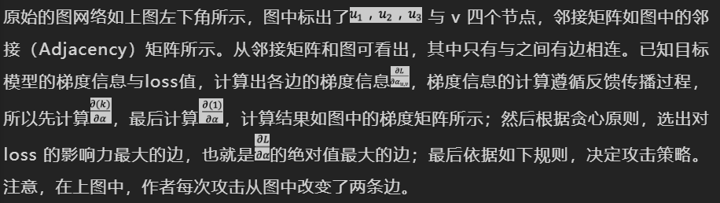

### 1 背景

#### 调研

我在国内的两个著名的学术搜索网站 AMiner 和 Acemap 进行了调查，以 adversarial attack和相近意思的 poisoning attack 等词作为关键词搜索了相关的论文，以下是两个网站给出的论文数据分析图表。

一方面，从图中很明显可以看出，在 2015 年直到今年，adversarial attack相关的论文显著增多，这说明了在机器学习发展飞速的今天，机器学习的安全问题逐渐被研究者们所重视。 所以我认为这个方向在未来几年应该会是一个新兴的热点。

对抗攻击论文的绝对数量至今仍很少，这说明了对抗攻击的可研究的东西还处于正在被研究者们逐渐挖掘的过程，还未形成一个体系。有研究价值

#### 攻击的起源

由于深度神经网络强大的表示学习能力，近几年它在许多领域都取得了很大的成功，包括计算机视觉、自然语言处理、语音识别等。然而，在其卓越性能的背后，深度神经网络作为一个黑箱，缺乏**可解释性与鲁棒性**，使得它易受到对抗攻击。

对抗攻击的开山之作 Intriguing properties of neural networks[12]，首次指出了图像识别问题中的对抗攻击问题，在一张原本能够被模型正确识别的图片上加一点精心构造的微小扰动，新图片在模型上得到了完全不同的结果。

该论文中提到了神经网络的两个现象：

- 第一个是高维神经网络的神经元并不是代表着某一个特征，而是所有特征混杂在所有神经元中;
- 第二个是在原样本点上加上一些针对性的但是不易察觉的扰动，就很容易导致神经网络的分类错误。

另一篇论文Explaining and Harnessing Adversarial Examples阐述了对抗攻击的理论基础，Goodfellow 提到，深度模型容易受攻击，并非是深层神经网络的高度非线性和过拟合，即使是线性模型也存在对抗样本。在这篇论文中，我们可以粗浅地认为对抗攻击之所以能够成功的原因是**误差放大效应**:

随后大量的围绕对抗攻击以及相应的防御策略的文章成为了近几年的学术界热点之一。

### 2. 图上的应用

#### 攻击的迁移

虽然这几年有大量的对抗攻防的工作产生，大部分的对抗攻击研究围绕图像、文本以及语音领域展开，对**图（Graph/Network）**的对抗攻击的研究则很少。而图是一种重要的数据结构，它在我们的生活中也有着广泛的应用。

- 社交网络

- 金融机构往往会结合贷款人的金钱交易记录来评估其信用情况，在这里人与人之间的交易记录就是用图来表征的。
- 分子化合物网络，是否致癌
- 文献引用网络

攻击的实际意义：

- 社交网络：水军账户通过关注正常账户，发布日常内容，来降低自己在社交网络的中可疑度，从而避免被检测到而封号
- 金融网络：辅助检测欺诈交易。现在假设恶意用户修改自己的一些属性信息以及与其他用户的连接，就能够躲过检测系统实现攻击
- 节点分类，链路预测，社区检测：隐私保护

因此研究图上的对抗攻击很有必要。

#### 基本概念

- 不被察觉，其实就是给攻击设置了一个前提，**攻击者对图数据的攻击后的扰动必须满足与一些约束**，例如，我们加边或者减边不能太多条，要保持图的基本结构等等，这是对抗攻击实现的前提。

- 分类

  - 扰动的分类

    - 维持结构的扰动（Structure-preserving Perturbation）：加减节点和边会改变一些图的结构属性，例如度分布，节点中心性。其本质都是对边（Link）的改变。所以新产生的对抗样本要保持这些结构属性的变化在一定范围内。目前大部分文章都是这种类型的攻击；

    - 维持属性的扰动（Attribute-preserving Perturbation）：第二种扰动是通过修改节点属性特征来实现，所以攻击者要保证这些属性不能发生明显变化，我们可以通过衡量节点（边）特征向量的相似度来维持特征的稳定性。去年KDD [1] 的文章就攻击了节点的属性特征。
      

  - **AI模型的完整性主要体现在模型的学习和预测过程完整不受干扰，输出结果符合模型的正常表现上。**

    从计算机安全研究角度来说，对抗攻击不是一个新的话题，因为对抗攻击本来就是计算机安全研究的一个传统研究方向和研究手段。在对图数据攻击方法进行分类时，我们利用计算机安全研究的术语，将其分为投毒（poisoning）攻击和逃脱（evasion）攻击： 

    - 中毒攻击（Poisoning Attack）：新产生的对抗样本将被用于新算法的训练，形象地来说，攻击者对算法的训练集进行投毒，从而影响训练好的算法在未被污染的测试集上面的表现；

    - 逃逸攻击（Evasion Attack）：新产生的对抗样本只存在测试集中，算法将在未被污染的训练集上训练。攻击者的目标是让对抗样本影响原来训练好的算法在测试集的表现。

      自动驾驶汽车、物联网设备、语音识别系统

  - 根据攻击者掌握的信息

    - 白盒攻击（White Box Attack）：攻击者掌握对方系统的所有信息，包括使用何种方法，算法输出结果，计算中的梯度等等。这种场景是指当攻击者完全攻入目标系统的时候；

    - 灰盒攻击（Grey Box Attack）：攻击只掌握一部分信息便可以发动攻击，这种攻击比白盒攻击更具有危害，因为攻击者不需要完全攻破目标系统就可以发动攻击。

    - 黑盒攻击（Black Box Attack）：攻击者只能查询到有限的攻击结果，对目标系统的机制完全不了解。这种攻击难度最大，对与防御方的危害也最大。

### 攻击节点分类

#### 攻击

- 其中 ![[公式]](https://www.zhihu.com/equation?tex=%5Cmathcal%7BP%7D_%7B%5CDelta%2CA%7D%5E%7BG0%7D) 表示所有扰动样本组成的空间。这个公式可以这样理解，对于所有扰动样本，找出使得在其上训练得到的分类器 ![[公式]](https://www.zhihu.com/equation?tex=Z%5E%2A) 对于目标节点 ![[公式]](https://www.zhihu.com/equation?tex=v_0) 的分类错误率最高的样本，该样本即为对抗样本。	

- **Target vs. Attackers**. 我们的目标是攻击一个特定的节点 ![[公式]](https://www.zhihu.com/equation?tex=v_0%5Cin%5Cmathcal%7BV%7D) ，使得其预测发生变化。由于图是一个非i.i.d.数据，对 ![[公式]](https://www.zhihu.com/equation?tex=v_0) 的预测不仅和自身的有关，还和图中其他节点有关（尤其是其邻域节点）。因此考虑将节点分类target节点和attacker节点，target节点即为目标节点，attacker节点即为我们可以操纵的节点（在其上施加扰动），

#### 扰动的约束

如何定义图上的扰动是不可分辨的？对于图来说有两种扰动，一种是结构扰动，一种是特征扰动，分别定义。

- 对于一张图而言，最重要的结构相关的特征就是图的degree distribution，因此这里定义如果扰动后的图的degree distribution与原图很不一样，认为这样的扰动很容易被分辨。
- 除了图结构以外，也可以改动节点的属性，因此需要定义节点属性的扰动代价。作者认为对于节点属性而言，其最重要的判别依据应该是特征的共现关系。比如两个在原图中从未共现过的特征在扰动后的图中共现了，那么这样的扰动是容易被分辨的。相反，如果两个特征经常一起出现，而某个节点特征中他们没有共现，扰动以后他们共现了，这对我们来说是不容易分辨的。举个例子，一篇关于深度学习的文章很可能同时出现“深度学习”和“神经网络”，如果某个深度学习文章这两个单词没有共同出现，而我们只需要稍微修改就可以使得他们共现，并且不会使得文章很突兀；相反如果我们想加入“氢氧化钠”这种词汇，会使得文章很突兀。

 

### 论文2

#### 强化学习攻击

#### 梯度攻击

这些附加系数为我们提供了关于每条边(存在的或不存在的)的梯度信息。

基于上述梯度计算的讨论，就能将基于白盒攻击的梯度对抗攻击目标形式化成如下所示的优化问题：

通过对图进行拓扑结构上的修改，使得梯度的值最大化，梯度越大，代表对应的这条边对分类器决策的影响越重要。具体如下图所示：

### 防御

- 数据预处理
  - 常见的对抗攻击生成的对抗样本与原始样本在统计上存在显著差异：对抗攻击生成的对抗样本趋向于修改节点相似性低的两个节点之间的连边。对网络进行预处理，删除节点相似性低于阈值的连边，再将处理之后的网络重新进行分类，发现该预处理对原始网络的精度并没有影响，但是降低了大多数攻击方法的攻击效果。